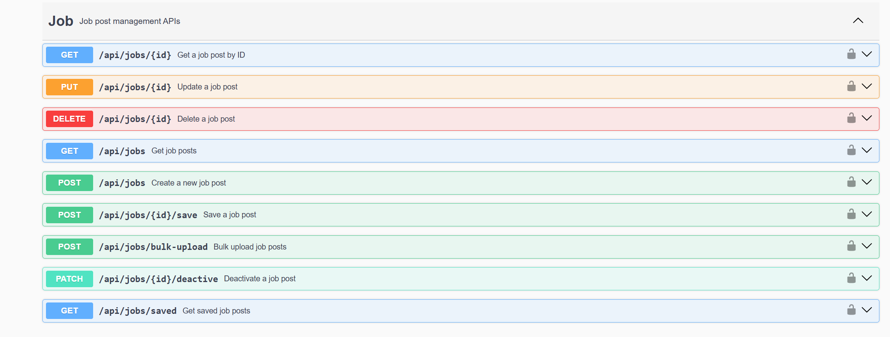
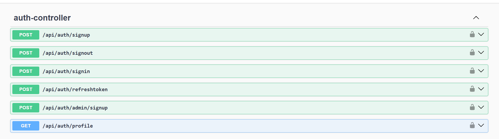

# 🧑‍🎓 University Job Posting API
A RESTful API for managing job postings at universities, built with Spring Boot and PostgreSQL.

Actor:
- Admin, Moderator: Manage job posts, users, and perform bulk uploads.
- Student: Search and go to company website or hiring platform , save job posts, suggest job posts.

## 📦 Setup Instructions

### Requirements

- Java 21+
- PostgreSQL 15+

### Run locally

```bash
git clone https://github.com/thnhan1/job-seek.git
cd job-seek

# Configure PostgreSQL in src/main/resources/application.yml
spring:
  datasource:
    url: jdbc:postgresql://localhost:5432/job_api
    username: postgres
    password: your_password

# Run the app
./mvnw spring-boot:run
````

> Swagger UI: [http://localhost:8080/swagger-ui/index.html](http://localhost:8080/swagger-ui/index.html)

---

## 🔐 Authentication API

| Method | Endpoint                 | Description                        |
| ------ | ------------------------ | ---------------------------------- |
| POST   | `/api/auth/signup`       | Register a new user (student)      |
| POST   | `/api/auth/signin`       | Login and receive access token     |
| POST   | `/api/auth/signout`      | Logout and invalidate token        |
| POST   | `/api/auth/refreshtoken` | Get a new token from refresh token |
| POST   | `/api/auth/admin/signup` | Register a new admin (admin only)  |
| GET    | `/api/auth/profile`      | Get current user profile           |

---

## 📄 Job Management API

| Method | Endpoint                    | Description                     |
| ------ | --------------------------- | ------------------------------- |
| GET    | `/api/jobs`                 | Get list of job posts           |
| GET    | `/api/jobs/{id}`            | Get a job post by ID            |
| POST   | `/api/jobs`                 | Create a new job post           |
| PUT    | `/api/jobs/{id}`            | Update a job post               |
| DELETE | `/api/jobs/{id}`            | Delete a job post               |
| PATCH  | `/api/jobs/{id}/deactivate` | Deactivate a job post           |
| POST   | `/api/jobs/{id}/save`       | Save a job post (user action)   |
| GET    | `/api/jobs/saved`           | Get all saved job posts of user |
| POST   | `/api/jobs/bulk-upload`     | Bulk upload jobs via CSV file   |

---

> 💡 Admins or moderators can upload multiple job posts at once using CSV format.

**Accepted CSV headers:**

```csv
company_name,major,job_title,description,company_image_url,job_url,contact_email,location,expires_at
```

**Example:**

```csv
FPT Software,Computer_Science,Frontend Developer Intern,Thực tập phát triển giao diện React,https://fpt.com/logo.png,https://fpt.com/careers/frontend-intern,hr@fpt.com,Hanoi,2025-08-02
VNG Corporation,Information_Technology,Backend Java Developer,Phát triển hệ thống backend với Spring Boot,https://vng.com/logo.png,https://vng.com/jobs/java-backend,recruit@vng.com,Ho Chi Minh City,2025-08-17
```

**Upload via:**
`POST /api/jobs/bulk-upload` with `multipart/form-data`

## Swagger UI




## Front END
Nextjs app at repo.
[job-seek-frontend](https://github.com/thnhan1/job-seek-ui.git)

## License
This project is licensed under the MIT License - see the [LICENSE](LICENSE) file for details.
